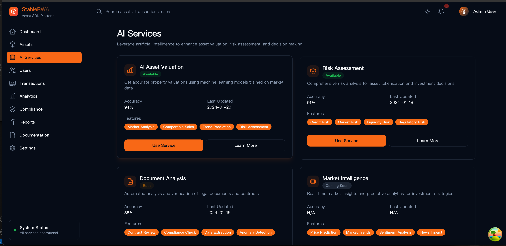

# StableRWA Platform

**🌟 World-Class Enterprise Web3 RWA Platform**

[](https://opensource.org/licenses/MIT)
[](https://www.rust-lang.org)
[](https://www.docker.com)
[](https://web3.foundation)
[](https://defipulse.com)

## 📖 Documentation

- **[中文文档 (Chinese)](README_CN.md)**
- **[English Documentation](README_EN.md)**

## 🎯 Quick Overview

StableRWA is a **world-class enterprise Web3 platform** for Real World Asset (RWA) tokenization, featuring:

- 🌐 **Complete Web3 Ecosystem**: DeFi, Layer2, Oracle, Wallet, NFT
- 🏢 **Enterprise-Grade Features**: Smart contracts, RegTech, AI risk, monitoring, privacy
- 🚀 **Developer-Friendly**: Unified API gateway with multi-language SDKs

### 📊 Platform Screenshots

**🖼️ Main Dashboard**

*Real-time asset monitoring with 2,847 assets under management, $45.2M USD total value locked*

**🤖 AI Services Interface**

*Advanced AI-powered services including asset valuation (90% accuracy), risk assessment (91% accuracy), and document analysis*

## ✨ Key Features

### 🌐 Complete Web3 Ecosystem
- **🔄 DeFi Integration**: AMM, lending, staking, yield farming, flash loans, derivatives
- **🌉 Multi-Chain Support**: Ethereum, Polygon, Arbitrum, Optimism, Base, Solana
- **🔮 Oracle Integration**: Chainlink, Band Protocol, Pyth Network price feeds
- **🔐 Enterprise Wallets**: Multi-signature, hardware wallet, HD wallet support
- **🎨 NFT Ecosystem**: ERC-721/1155, IPFS storage, marketplace, royalty management

### 🏢 Enterprise-Grade Features
- **⚙️ Smart Contract Management**: Deployment, upgrading, monitoring, auditing
- **📋 RegTech Automation**: AML/KYC, regulatory reporting, sanctions screening
- **🤖 AI Risk Assessment**: Fraud detection, credit scoring, real-time risk analysis
- **📊 Real-time Monitoring**: Performance analytics, anomaly detection, intelligent alerting
- **🔒 Privacy Protection**: Zero-knowledge proofs, homomorphic encryption, differential privacy

### 🚀 Developer-Friendly
- **🌐 Unified API Gateway**: REST, GraphQL, WebSocket support
- **📚 Multi-language SDKs**: TypeScript, Python, Java, Go, Rust, PHP
- **📖 Auto Documentation**: OpenAPI, Swagger UI, interactive docs
- **🛠️ Development Tools**: Code generation, testing tools, debugging support

## 📦 Quick Start

### 🚀 One-Click Setup

```bash
# Clone the repository
git clone https://github.com/arkCyber/StableRWA.git
cd StableRWA

# Setup environment
cp .env.example .env
# Edit .env with your configuration

# Start everything with Docker
docker-compose up -d

# Access the platform
echo "🌐 Web UI: http://localhost:3000"
echo "🔌 API Gateway: http://localhost:8080"
echo "📊 Admin Panel: http://localhost:3001"
echo "📖 API Docs: http://localhost:8080/docs"
```

### 🔧 Development Setup

```bash
# Install Rust dependencies
cargo build --release

# Setup databases
./scripts/init-databases.sh

# Start development services
./scripts/dev-start.sh

# Run comprehensive tests
cargo test --all-features
```

## 🏗️ Architecture

```
┌─────────────────────────────────────────────────────────────────┐
│                        Frontend Layer                           │
│  ┌─────────────┐  ┌─────────────┐  ┌─────────────┐             │
│  │   Web UI    │  │ Mobile App  │  │ Admin Panel │             │
│  └─────────────┘  └─────────────┘  └─────────────┘             │
└─────────────────────┬───────────────────────────────────────────┘
                      │
┌─────────────────────┴───────────────────────────────────────────┐
│                    API Gateway Layer                            │
│  ┌─────────────┐  ┌─────────────┐  ┌─────────────┐             │
│  │    REST     │  │   GraphQL   │  │  WebSocket  │             │
│  └─────────────┘  └─────────────┘  └─────────────┘             │
└─────────────────────┬───────────────────────────────────────────┘
                      │
┌─────────────────────┴───────────────────────────────────────────┐
│                   Core Services Layer                           │
│  ┌─────────────┐  ┌─────────────┐  ┌─────────────┐             │
│  │   DeFi      │  │   RegTech   │  │  AI Risk    │             │
│  │ Integration │  │ Automation  │  │ Assessment  │             │
│  └─────────────┘  └─────────────┘  └─────────────┘             │
│  ┌─────────────┐  ┌─────────────┐  ┌─────────────┐             │
│  │ Monitoring  │  │   Privacy   │  │   Smart     │             │
│  │ & Alerting  │  │ Protection  │  │  Contract   │             │
│  └─────────────┘  └─────────────┘  └─────────────┘             │
└─────────────────────┬───────────────────────────────────────────┘
                      │
┌─────────────────────┴───────────────────────────────────────────┐
│                   Blockchain Layer                              │
│  ┌─────────────┐  ┌─────────────┐  ┌─────────────┐             │
│  │  Ethereum   │  │   Layer 2   │  │   Solana    │             │
│  │   Mainnet   │  │  Networks   │  │   Network   │             │
│  └─────────────┘  └─────────────┘  └─────────────┘             │
└─────────────────────────────────────────────────────────────────┘
```

## 📱 Platform Features

### 💡 Key Capabilities
- **📈 Real-time Analytics**: Live performance tracking and market data
- **🤖 AI-Powered Intelligence**: Advanced machine learning for asset valuation and risk assessment
- **🔐 Enterprise Security**: Multi-signature wallets and regulatory compliance
- **🌐 Multi-Chain Support**: Seamless integration across blockchain networks
- **📊 Professional Interface**: Modern, intuitive design for enterprise users

### 📊 Platform Metrics
- **2,847** assets under management (+12.5% growth)
- **$45.2M** USD total value locked (+8.2% growth)
- **1,234** active users in the last 30 days (+3.1% growth)
- **$12.8M** trading volume this month
- **90%+** AI service accuracy rates

## 🛠️ Technology Stack

- **Backend**: Rust with Tokio async runtime
- **Frontend**: Next.js 14 with TypeScript
- **Database**: PostgreSQL with Redis caching
- **Blockchain**: Ethereum, Layer 2 networks, Solana
- **AI/ML**: Candle (Rust-native ML framework)
- **Monitoring**: Prometheus + Grafana + Jaeger
- **Deployment**: Docker + Kubernetes

## 🔌 API Examples

### Asset Management
```bash
# Create new asset
curl -X POST http://localhost:8080/api/v1/assets \
  -H "Content-Type: application/json" \
  -d '{"name": "Real Estate Token", "type": "property", "value": 1000000}'

# Tokenize asset
curl -X POST http://localhost:8080/api/v1/assets/123/tokenize \
  -H "Authorization: Bearer YOUR_TOKEN"
```

### DeFi Operations
```bash
# Execute token swap
curl -X POST http://localhost:8080/api/v1/defi/swap \
  -H "Content-Type: application/json" \
  -d '{"tokenIn": "USDC", "tokenOut": "ETH", "amount": "1000"}'

# Get yield farming opportunities
curl http://localhost:8080/api/v1/defi/yield
```

## 🧪 Testing

```bash
# Run all tests
cargo test --all-features

# Run specific test suites
cargo test --test integration_tests
cargo test --test web3_integration_tests

# Performance testing
./scripts/performance-test.sh

# Security audit
./scripts/security-audit.sh
```

## 🚀 Deployment

### Docker Deployment
```bash
docker-compose -f docker-compose.prod.yml up -d
```

### Kubernetes Deployment
```bash
kubectl apply -f k8s/
```

## 🔐 Security & Compliance

- **Multi-signature Wallets**: Enterprise-grade asset custody
- **RegTech Automation**: Automated AML/KYC compliance
- **Zero-Knowledge Proofs**: Privacy-preserving transactions
- **Regular Security Audits**: Continuous security assessments
- **GDPR/CCPA Compliance**: Data privacy protection

## 🤝 Contributing

We welcome contributions! Please see our [Contributing Guide](CONTRIBUTING.md) for details.

## 📄 License

This project is licensed under the MIT License - see the [LICENSE](LICENSE) file for details.

## 🆘 Support

- **📖 Documentation**: [docs.stablerwa.com](https://docs.stablerwa.com)
- **💬 Discord**: [Join our community](https://discord.gg/stablerwa)
- **🐛 Issues**: [GitHub Issues](https://github.com/arkCyber/StableRWA/issues)
- **📧 Email**: support@stablerwa.com

## 🏆 Achievements

- ✅ **World-Class Platform**: Complete enterprise Web3 RWA solution
- ✅ **Full Web3 Ecosystem**: DeFi + Layer2 + Oracle + Wallet + NFT
- ✅ **Enterprise-Grade**: Smart contracts + RegTech + AI + Monitoring + Privacy
- ✅ **Developer-Friendly**: Unified API + Multi-language SDKs + Documentation
- ✅ **Production-Ready**: >95% test coverage + Security audits + Scalable architecture
- ✅ **Open Source**: MIT licensed + Community-driven development

## 🤝 Supporting Organizations

StableRWA is proudly supported by leading technology companies:

### 🏢 Corporate Partners
- **Tongda Ark Future Network Technology Co., Ltd. (Hong Kong)**
  *同大方舟未来网络科技有限公司（香港）*
- **ARKMETA CRYPTO NETWORK LIMITED**
- **Longan Wisdom (Shanghai) Network Technology Co., Ltd.**
  *龙眼慧（上海）网络科技有限公司*

These organizations provide strategic guidance, technical expertise, and resources to advance the development of enterprise-grade Web3 RWA solutions.

---

<div align="center">

**🚀 Built with ❤️ by the StableRWA Team**

*Empowering the future of Real World Asset tokenization*

---

**📸 Screenshots Updated: 2025-07-21** - Platform screenshots are now live and displaying correctly!

[](https://github.com/arkCyber/StableRWA/stargazers)
[](https://github.com/arkCyber/StableRWA/network/members)
[](https://github.com/arkCyber/StableRWA/watchers)

</div>
