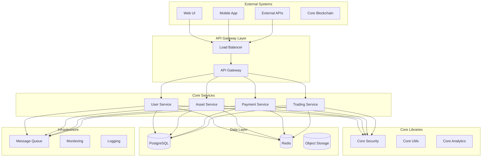

# StableRWA Platform Architecture

## Overview

StableRWA is a comprehensive Real World Asset (RWA) tokenization platform built with Rust, designed for enterprise-grade security, scalability, and compliance. The platform enables the tokenization, trading, and management of real-world assets on blockchain networks.

## Architecture Principles

### 1. Microservices Architecture
- **Service Isolation**: Each service is independently deployable and scalable
- **Domain-Driven Design**: Services are organized around business domains
- **API-First**: All services expose well-defined REST APIs
- **Event-Driven**: Asynchronous communication through message queues

### 2. Security-First Design
- **Zero Trust Architecture**: No implicit trust between components
- **Defense in Depth**: Multiple layers of security controls
- **Encryption Everywhere**: Data encrypted at rest and in transit
- **Principle of Least Privilege**: Minimal access rights

### 3. Cloud-Native
- **Container-First**: All services containerized with Docker
- **Kubernetes Native**: Designed for Kubernetes orchestration
- **12-Factor App**: Following cloud-native best practices
- **Infrastructure as Code**: Terraform for infrastructure management

### 4. Observability
- **Structured Logging**: JSON-formatted logs with correlation IDs
- **Metrics Collection**: Prometheus-compatible metrics
- **Distributed Tracing**: OpenTelemetry integration
- **Health Monitoring**: Comprehensive health checks

## System Architecture

## Core Components

### 1. API Gateway (service-gateway)
- **Purpose**: Single entry point for all client requests
- **Responsibilities**:
  - Request routing and load balancing
  - Authentication and authorization
  - Rate limiting and throttling
  - Request/response transformation
  - API versioning
  - Monitoring and logging

### 2. User Service (service-user)
- **Purpose**: User management and authentication
- **Responsibilities**:
  - User registration and profile management
  - Authentication and session management
  - Role-based access control (RBAC)
  - KYC/AML compliance
  - User preferences and settings

### 3. Asset Service (service-asset)
- **Purpose**: Asset lifecycle management
- **Responsibilities**:
  - Asset registration and metadata management
  - Asset valuation and appraisal
  - Document management and verification
  - Asset tokenization
  - Compliance tracking

### 4. Payment Service (service-payment)
- **Purpose**: Payment processing and financial operations
- **Responsibilities**:
  - Payment method management
  - Transaction processing
  - Settlement and reconciliation
  - Multi-currency support
  - Financial reporting

### 5. Trading Service (service-trading)
- **Purpose**: Trading and liquidity management
- **Responsibilities**:
  - Order book management
  - Trade matching and execution
  - Liquidity pool management
  - Market data distribution
  - Risk management

## Core Libraries

### 1. Core Security (core-security)
- JWT token management
- Encryption/decryption utilities
- Password hashing and validation
- API key management
- Audit logging

### 2. Core Blockchain (core-blockchain)
- Multi-chain support (Ethereum, Polygon, BSC, etc.)
- Wallet management
- Smart contract interaction
- Transaction monitoring
- Gas optimization

### 3. Core Utils (core-utils)
- Common data structures
- Configuration management
- Error handling
- Validation utilities
- Date/time utilities

### 4. Core Analytics (core-analytics)
- Metrics collection and aggregation
- Real-time analytics
- Report generation
- Dashboard data
- Performance monitoring

## Data Architecture

### 1. Primary Database (PostgreSQL)
- **User Data**: Profiles, authentication, preferences
- **Asset Data**: Metadata, valuations, documents
- **Transaction Data**: Payments, trades, settlements
- **Audit Data**: System events, compliance records

### 2. Cache Layer (Redis)
- **Session Storage**: User sessions and tokens
- **Application Cache**: Frequently accessed data
- **Rate Limiting**: Request counters and limits
- **Real-time Data**: Market data, notifications

### 3. Object Storage (S3)
- **Document Storage**: Asset documents, certificates
- **Media Files**: Images, videos, presentations
- **Backup Data**: Database backups, logs
- **Static Assets**: Web assets, templates

### 4. Message Queue (RabbitMQ)
- **Event Streaming**: Domain events, notifications
- **Async Processing**: Background jobs, batch operations
- **Service Communication**: Inter-service messaging
- **Workflow Orchestration**: Multi-step processes

## Security Architecture

### 1. Authentication & Authorization
- **JWT Tokens**: Stateless authentication
- **OAuth 2.0**: Third-party integration
- **RBAC**: Role-based access control
- **MFA**: Multi-factor authentication

### 2. Data Protection
- **Encryption at Rest**: AES-256 encryption
- **Encryption in Transit**: TLS 1.3
- **Key Management**: AWS KMS integration
- **Data Masking**: PII protection

### 3. Network Security
- **VPC**: Isolated network environment
- **Security Groups**: Firewall rules
- **WAF**: Web application firewall
- **DDoS Protection**: CloudFlare integration

### 4. Compliance
- **SOC 2**: Security controls
- **PCI DSS**: Payment card security
- **GDPR**: Data privacy compliance
- **AML/KYC**: Anti-money laundering

## Deployment Architecture

### 1. Kubernetes Cluster
- **Multi-AZ Deployment**: High availability
- **Auto-scaling**: Horizontal pod autoscaling
- **Rolling Updates**: Zero-downtime deployments
- **Resource Management**: CPU/memory limits

### 2. Infrastructure as Code
- **Terraform**: Infrastructure provisioning
- **Helm Charts**: Kubernetes deployments
- **GitOps**: Configuration management
- **Environment Parity**: Dev/staging/production

### 3. CI/CD Pipeline
- **GitHub Actions**: Automated workflows
- **Security Scanning**: Vulnerability detection
- **Quality Gates**: Code quality checks
- **Deployment Automation**: Automated releases

## Monitoring & Observability

### 1. Metrics (Prometheus)
- **Application Metrics**: Request rates, latencies
- **Business Metrics**: User activity, transactions
- **Infrastructure Metrics**: CPU, memory, disk
- **Custom Metrics**: Domain-specific KPIs

### 2. Logging (ELK Stack)
- **Structured Logging**: JSON format
- **Centralized Logs**: Elasticsearch storage
- **Log Analysis**: Kibana dashboards
- **Alerting**: Log-based alerts

### 3. Tracing (Jaeger)
- **Distributed Tracing**: Request flow tracking
- **Performance Analysis**: Latency bottlenecks
- **Error Tracking**: Exception propagation
- **Service Dependencies**: Call graph visualization

### 4. Alerting (AlertManager)
- **Threshold Alerts**: Metric-based alerts
- **Anomaly Detection**: ML-based alerting
- **Escalation Policies**: Alert routing
- **Notification Channels**: Slack, email, PagerDuty

## Scalability Considerations

### 1. Horizontal Scaling
- **Stateless Services**: Easy horizontal scaling
- **Load Balancing**: Traffic distribution
- **Database Sharding**: Data partitioning
- **Caching Strategy**: Reduce database load

### 2. Performance Optimization
- **Connection Pooling**: Database connections
- **Async Processing**: Non-blocking operations
- **CDN**: Static asset delivery
- **Compression**: Response compression

### 3. Capacity Planning
- **Resource Monitoring**: Usage tracking
- **Growth Projections**: Capacity forecasting
- **Auto-scaling**: Dynamic resource allocation
- **Cost Optimization**: Resource efficiency

## Disaster Recovery

### 1. Backup Strategy
- **Database Backups**: Point-in-time recovery
- **File Backups**: Document and media files
- **Configuration Backups**: Infrastructure state
- **Cross-region Replication**: Geographic redundancy

### 2. High Availability
- **Multi-AZ Deployment**: Availability zones
- **Failover Mechanisms**: Automatic failover
- **Health Checks**: Service monitoring
- **Circuit Breakers**: Fault isolation

### 3. Recovery Procedures
- **RTO/RPO Targets**: Recovery objectives
- **Runbooks**: Step-by-step procedures
- **Testing**: Regular DR testing
- **Communication**: Incident response

## Future Considerations

### 1. Technology Evolution
- **Rust Ecosystem**: New crate adoption
- **Blockchain Integration**: New chain support
- **AI/ML Integration**: Intelligent features
- **Edge Computing**: Distributed processing

### 2. Business Growth
- **Multi-tenancy**: SaaS model support
- **Internationalization**: Global expansion
- **Regulatory Compliance**: New jurisdictions
- **Partner Integrations**: Third-party services

### 3. Performance Scaling
- **Microservices Decomposition**: Further service splitting
- **Event Sourcing**: Event-driven architecture
- **CQRS**: Command query separation
- **Serverless**: Function-as-a-service adoption
